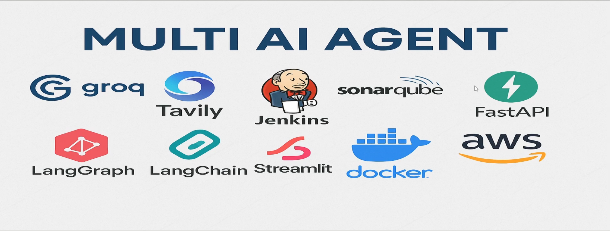

# 🚀 Multi AI Agent Platform

A production-oriented **multi-agent AI orchestration platform** for LLM workflows, built with **LangGraph, LangChain, Groq, Tavily, FastAPI, Streamlit, Docker, Jenkins, SonarQube, AWS ECR, and AWS ECS Fargate**.

This project demonstrates a complete workflow from local development to containerized CI/CD deployment on AWS.

---

## 📌 Project Overview

The platform implements a modular multi-agent system where LLM agents can perform reasoning, tool usage, search, and workflow execution. The project also includes a production-style DevOps pipeline with Jenkins, SonarQube, Docker, AWS ECR, and AWS ECS Fargate.

---

## 🧰 Tools & Technologies



### AI / LLM Stack
- Groq API
- Tavily API
- HuggingFace token
- LangChain
- LangGraph
- Chroma / AstraDB
- Streamlit
- FastAPI

### DevOps / Deployment Stack
- Docker
- Jenkins
- SonarQube
- GitHub
- AWS ECR
- AWS ECS Fargate

---

## 🏗️ Workflow Architecture


### High-Level Flow

1. Project setup with API keys, virtual environment, logging, and custom exceptions.
2. Core multi-agent workflow using LangChain and LangGraph.
3. Backend service using FastAPI.
4. Frontend interface using Streamlit.
5. Code pushed to GitHub.
6. Jenkins pipeline triggers CI/CD.
7. SonarQube performs code quality analysis.
8. Docker image is built and pushed to AWS ECR.
9. Container is deployed to AWS ECS Fargate.

---

## 📁 Project Structure

```bash
MULTI-AI-AGENT-PROJECTS/
├── app/
│   └── main.py
├── custom_jenkins/
│   └── Dockerfile
├── docs/
│   ├── multi_ai_agent_tools_overview.png
│   └── multi_ai_agent_workflow.png
├── Dockerfile
├── Jenkinsfile
├── README.md
├── setup.py
├── requirements.txt
├── .gitignore
└── .env
```

---

## 🔐 API Keys & Environment Variables

You need the following API keys:

- Groq API key: https://console.groq.com/keys
- Tavily API key: https://app.tavily.com/home
- HuggingFace token: should have write access if required by your workflow

Create a `.env` file in the project root:

```env
GROQ_API_KEY=your_groq_api_key
TAVILY_API_KEY=your_tavily_api_key
HF_TOKEN=your_huggingface_token
```

> ⚠️ Never commit `.env` or real API keys to GitHub.

---

# ⚙️ Setup Instructions

## 1️⃣ WSL Installation

### Install WSL

Open **PowerShell as Administrator** and run:

```powershell
wsl --install
```

If WSL is already installed:

```powershell
wsl --update
```

Restart your machine if required.

---

## 2️⃣ Install Ubuntu via Microsoft Store

1. Open Microsoft Store.
2. Search for Ubuntu.
3. Install Ubuntu 22.04 LTS or a newer version.
4. Launch Ubuntu.
5. Create your Linux username and password.

---

## 3️⃣ Install Docker Engine inside Ubuntu WSL

Run the following commands inside Ubuntu terminal:

```bash
sudo apt update
sudo apt install ca-certificates curl gnupg lsb-release -y

sudo mkdir -p /etc/apt/keyrings
curl -fsSL https://download.docker.com/linux/ubuntu/gpg | sudo gpg --dearmor -o /etc/apt/keyrings/docker.gpg

echo \
  "deb [arch=$(dpkg --print-architecture) signed-by=/etc/apt/keyrings/docker.gpg] \
  https://download.docker.com/linux/ubuntu \
  $(lsb_release -cs) stable" | \
  sudo tee /etc/apt/sources.list.d/docker.list > /dev/null

sudo apt update
sudo apt install docker-ce docker-ce-cli containerd.io docker-buildx-plugin docker-compose-plugin -y

sudo usermod -aG docker $USER
```

Restart Ubuntu terminal and verify Docker:

```bash
docker --version
docker ps
```

---

## 4️⃣ Clone the Repository

```bash
git clone https://github.com/hossain-sanowar/multi-agent-platform.git
cd MULTI-AI-AGENT-PROJECTS
```

---

## 5️⃣ Create and Activate Virtual Environment

### Linux / WSL

```bash
python3 -m venv venv
source venv/bin/activate
```

### Windows

```bash
python -m venv venv
venv\Scripts\activate
```

---

## 6️⃣ Install Dependencies

```bash
pip install -e .
```

---

## 7️⃣ Run the Application Locally

```bash
python app/main.py
```

---

# 🐳 Docker Setup

## Build Docker Image

```bash
docker build -t multi-ai-agent .
```

## Run Docker Container

```bash
docker run -p 8501:8501 -p 9999:9999 --env-file .env multi-ai-agent
```

---

# 🔁 Jenkins CI/CD Setup

## Step 1: Build Custom Jenkins Docker Image

Go to the custom Jenkins folder:

```bash
cd custom_jenkins
docker build -t jenkins-dind .
```

---

## Step 2: Run Jenkins Container

```bash
docker run -d --name jenkins-dind \
  --privileged \
  -p 8080:8080 -p 50000:50000 \
  -v /var/run/docker.sock:/var/run/docker.sock \
  -v jenkins_home:/var/jenkins_home \
  jenkins-dind
```

---

## Step 3: Verify Jenkins Container

```bash
docker ps
```

---

## Step 4: Get Jenkins Initial Admin Password

```bash
docker logs jenkins-dind
```

Copy the initial admin password from the logs.

---

## Step 5: Find WSL IP Address

```bash
ip addr show eth0 | grep inet
```

Access Jenkins in browser:

```text
http://<WSL_IP>:8080
```

Example:

```text
http://172.23.129.123:8080
```

---

## Step 6: Jenkins Initial Setup

1. Paste the initial admin password.
2. Install suggested plugins.
3. Create first admin user.
4. Set Jenkins URL.
5. Start using Jenkins.

---

## Step 7: Install Python inside Jenkins Container

```bash
docker exec -u root -it jenkins-dind bash

apt update -y
apt install -y python3 python3-pip
ln -s /usr/bin/python3 /usr/bin/python

python --version
pip3 --version

exit
```

Restart Jenkins:

```bash
docker restart jenkins-dind
```

---

# 🔗 GitHub Integration with Jenkins

## 1️⃣ Generate GitHub Token

1. Go to GitHub.
2. Settings → Developer Settings → Personal Access Tokens → Tokens Classic.
3. Generate new token.
4. Select:
   - `repo`
   - `repo_hook`
5. Copy and store the token safely.

---

## 2️⃣ Add GitHub Credentials to Jenkins

1. Jenkins Dashboard → Manage Jenkins → Manage Credentials.
2. Select Global.
3. Add Credentials.
4. Type: Username with password.
5. Username: your GitHub username.
6. Password: GitHub token.
7. ID: `github-token`.

---

## 3️⃣ Create Jenkins Pipeline Job

1. Jenkins Dashboard → New Item.
2. Enter project name, e.g. `multi-ai-agent`.
3. Select Pipeline.
4. Under Pipeline:
   - Definition: Pipeline script from SCM
   - SCM: Git
   - Repository URL: your GitHub repo URL
   - Credentials: `github-token`
   - Branch: `*/main`
   - Script Path: `Jenkinsfile`
5. Save.

---

## 4️⃣ Run First Pipeline

1. Open Jenkins project.
2. Click Build Now.
3. Check build logs.
4. Confirm that Jenkins cloned the GitHub repository.

---

# 📊 SonarQube Integration

## Step 1: Run SonarQube Container

Before running SonarQube, configure system limits:

```bash
sudo sysctl -w vm.max_map_count=524288
sudo sysctl -w fs.file-max=131072
ulimit -n 131072
ulimit -u 8192
```

Run SonarQube:

```bash
docker run -d --name sonarqube-dind \
  -p 9000:9000 \
  sonarqube
```

Check container:

```bash
docker ps
```

Access SonarQube:

```text
http://<WSL_IP>:9000
```

Default login:

```text
Username: admin
Password: admin
```

---

## Step 2: Install Jenkins SonarQube Plugins

Install from Jenkins Plugin Manager:

- SonarQube Scanner
- Sonar Quality Gates

Restart Jenkins:

```bash
docker restart jenkins-dind
```

---

## Step 3: Create SonarQube Token

1. Login to SonarQube.
2. My Account → Security.
3. Generate token:
   - Name: `sonarqube-token`
   - Type: Global Analysis Token
4. Copy token.

---

## Step 4: Add SonarQube Token to Jenkins

1. Jenkins → Manage Credentials → Global.
2. Add Credential.
3. Kind: Secret Text.
4. Secret: SonarQube token.
5. ID: `sonarqube-token`.

---

## Step 5: Configure SonarQube Server in Jenkins

1. Jenkins → Manage Jenkins → System.
2. Add SonarQube Server:
   - Name: `SonarQube`
   - URL: `http://<WSL_IP>:9000`
   - Token: `sonarqube-token`
3. Save.

---

## Step 6: Configure SonarQube Scanner

1. Jenkins → Manage Jenkins → Tools.
2. Add SonarQube Scanner.
3. Enable Install Automatically.
4. Save.

---

## Step 7: Connect Jenkins and SonarQube Containers

Create Docker network:

```bash
docker network create dind-network
```

Connect containers:

```bash
docker network connect dind-network jenkins-dind
docker network connect dind-network sonarqube-dind
```

Use container name in Jenkinsfile:

```groovy
-Dsonar.host.url=http://sonarqube-dind:9000
```

---

# ☁️ AWS ECR Setup

## Step 1: Install Jenkins AWS Plugins

Install Jenkins plugins:

- AWS SDK
- AWS Credentials

Restart Jenkins:

```bash
docker restart jenkins-dind
```

---

## Step 2: Create AWS IAM User

1. AWS Console → IAM → Users → Create User.
2. Create user, e.g. `multi-ai-agent`.
3. Attach policy:
   - `AmazonEC2ContainerRegistryFullAccess`
4. Create access key for CLI.
5. Copy:
   - Access Key ID
   - Secret Access Key

---

## Step 3: Add AWS Credentials to Jenkins

1. Jenkins → Manage Credentials → Global.
2. Add Credentials.
3. Kind: AWS Credentials.
4. ID: `aws-credentials`.
5. Add Access Key ID and Secret Access Key.

---

## Step 4: Install AWS CLI inside Jenkins Container

```bash
docker exec -u root -it jenkins-dind bash

apt update
apt install -y unzip curl

curl "https://awscli.amazonaws.com/awscli-exe-linux-x86_64.zip" -o "awscliv2.zip"
unzip awscliv2.zip
./aws/install

aws --version

exit
```

---

## Step 5: Create ECR Repository

1. AWS Console → ECR.
2. Create repository, e.g. `multi-ai-agent`.
3. Copy repository URI.
4. Update Jenkinsfile with ECR repository URI.

---

## Step 6: Build and Push Docker Image to ECR

1. Uncomment the Build and Push Docker Image stage in Jenkinsfile.
2. Commit and push:

```bash
git add .
git commit -m "Update Jenkinsfile for ECR deployment"
git push origin main
```

3. Run Jenkins pipeline.
4. Confirm image is pushed to ECR.

---

# 🚀 AWS ECS Fargate Deployment

## Step 1: Create ECS Cluster

1. AWS Console → ECS → Clusters.
2. Create Cluster.
3. Select Fargate.
4. Name it, e.g. `multi-ai-agent`.

---

## Step 2: Create ECS Task Definition

1. ECS → Task Definitions → Create New Task Definition.
2. Launch type: Fargate.
3. OS: Linux/X86_64.
4. CPU: 2 vCPU.
5. Memory: 6 GB.
6. Add container:
   - Container name: `multi-ai-agent`
   - Image URI: ECR image URI
   - Essential: Yes
7. Add port mappings:
   - 8501 TCP
   - 9999 TCP
8. Add environment variables:
   - `GROQ_API_KEY`
   - `TAVILY_API_KEY`
   - `HF_TOKEN`
9. Create task definition.

---

## Step 3: Create ECS Service

1. ECS → Cluster → Create Service.
2. Launch type: Fargate.
3. Select task definition.
4. Service name: `multi-ai-agent-service`.
5. Enable public IP.
6. Create service.

---

## Step 4: Configure Security Group

Add inbound rules:

| Type | Port | Source |
|---|---:|---|
| Custom TCP | 8501 | 0.0.0.0/0 |
| Custom TCP | 9999 | 0.0.0.0/0 |

---

## Step 5: Access Application

After deployment:

1. Open ECS cluster.
2. Open running task.
3. Copy public IP.
4. Open:

```text
http://<PublicIP>:8501
```

---

# 🤖 Automate ECS Deployment with Jenkins

## Step 1: Add ECS Permission to IAM User

Attach policy:

```text
AmazonECS_FullAccess
```

or:

```text
AmazonEC2ContainerServiceFullAccess
```

---

## Step 2: Update Jenkinsfile

Uncomment deployment stage:

```text
Deploy to ECS Fargate
```

Update:

- Cluster name
- Service name
- Task definition
- Region

Push changes:

```bash
git add .
git commit -m "Update ECS deployment configuration"
git push origin main
```

---

## Step 3: Run Jenkins Pipeline

1. Open Jenkins dashboard.
2. Click Build Now.
3. Confirm ECS service updates.
4. Open app via public IP.

---

# 🧹 Cleanup

## Delete AWS Resources

Delete:

1. ECS Service
2. ECS Cluster
3. Task Definition
4. ECR Repository

---

## Clean Docker Locally

```bash
docker system prune -a --volumes -f
```

---

# ✅ Project Completion Checklist

- [x] WSL setup completed
- [x] Ubuntu installed
- [x] Docker Engine installed inside WSL
- [x] Local app runs successfully
- [x] Dockerfile created
- [x] GitHub repository configured
- [x] Jenkins container created
- [x] Jenkins pipeline configured
- [x] SonarQube integrated
- [x] Docker image pushed to AWS ECR
- [x] ECS Fargate deployment configured
- [x] Public app deployment completed

---

# 🔒 Security Best Practices

- Do not commit `.env`.
- Do not expose API keys in README, logs, screenshots, or GitHub.
- Rotate any leaked API keys immediately.
- Use AWS Secrets Manager or ECS secrets for production.
- Restrict IAM permissions using least privilege.
- Avoid `0.0.0.0/0` in production security groups unless required.

---

# 🚧 Future Improvements

- Add AWS Application Load Balancer.
- Add HTTPS with ACM certificate.
- Add domain name via Route 53.
- Use AWS Secrets Manager.
- Add Prometheus and Grafana monitoring.
- Add automated unit/integration tests.
- Add GitHub webhook for automatic Jenkins builds.
- Add blue/green deployment strategy.

---

# 👨‍💻 Author

**Md Sanowar Hossain**  
Machine Learning Engineer | Applied AI

- GitHub: https://github.com/hossain-sanowar
- LinkedIn: https://www.linkedin.com/in/HossainSanowar
